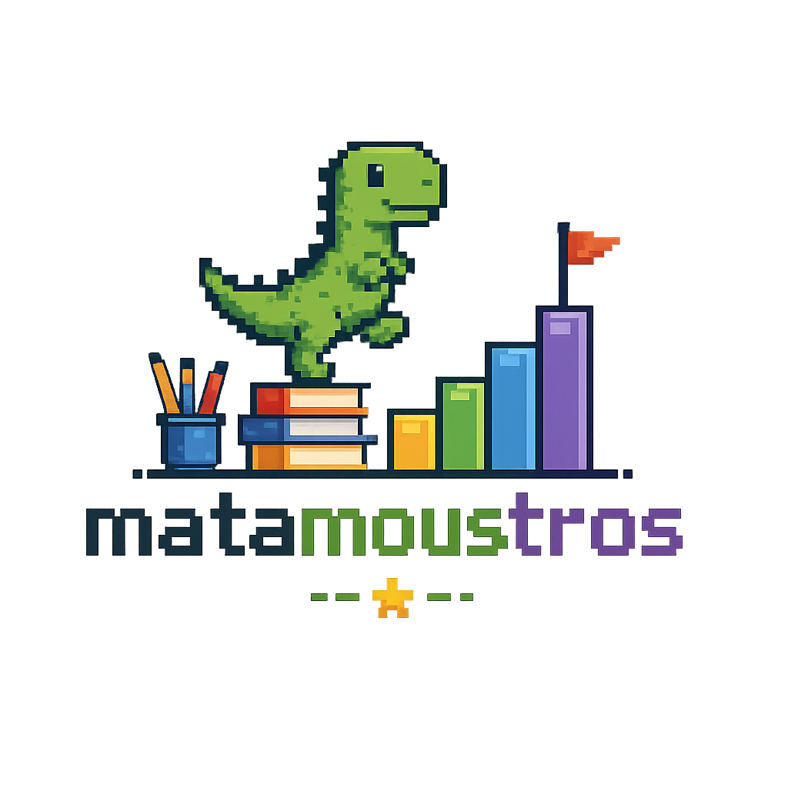

  

  
  
  
  
  

  
  
  
  
  

<h1 align="center">Matamounstruos App</h1>

Matamounstruos App es una aplicación web educativa basada en la gestión de barajas, cartas y tarjetas de teoría.

La propuesta del proyecto consiste en crear una aplicación sencilla donde el usuario pueda organizar contenido mediante barajas. Cada baraja tendrá sus propias cartas y tarjetas asociadas, permitiendo consultar y administrar la información de forma visual y ordenada.

El proyecto no busca ser un videojuego complejo, sino una aplicación web clara, funcional y fácil de mantener. La parte visual tendrá una temática más llamativa, pero la base del proyecto estará centrada en la gestión de datos y en una estructura sencilla de entender.

También se plantea como una herramienta para optimizar el tiempo durante la construcción del proyecto. La idea es que las propias cartas y tarjetas puedan servir para repasar partes importantes del código, recordar decisiones tomadas y consultar contenido útil mientras se desarrolla la aplicación.

De esta forma, el proyecto no solo sirve como entrega final, sino también como apoyo para estudiar y preparar la defensa. Incluso después de terminar la aplicación, las tarjetas podrán utilizarse para repasar conceptos, revisar cómo está organizado el código y facilitar la explicación de la autoría del trabajo realizado.

## Propuesta

La aplicación funcionará a partir de barajas.

Cada baraja podrá contener:

- Cartas.
- Tarjetas de teoría.

Las cartas representarán resultados, mensajes o elementos visuales relacionados con la baraja.

La primera baraja prevista tendrá un máximo de 12 cartas, tomando como referencia una baraja sencilla de 12 posiciones. Esta baraja podrá añadirse como datos iniciales en `seeds.sql`.

Ejemplo de primera baraja:

- 1 AUTORIA APROBADA      (APTO)
- 2, 3 y 4 NO APTO        (NO_APTO)
- 5, 6, 7, 8, 9 APTO      (APTO)
- 10 ESTUDIANTE EJEMPLAR  (APTO)
- 11 REINA                (PRUEBA_OTRA_VEZ)
- 12 REY                  (PRUEBA_OTRA_VEZ)

Cuando salga una carta con resultado `APTO`, la aplicación mostrará un mensaje de aprobado y podrá preguntar si se quiere probar otra vez.

Cuando salga una carta con resultado `NO_APTO` o `PRUEBA_OTRA_VEZ`, la aplicación mostrará una tarjeta formativa para repasar contenido relacionado con la baraja.

Las tarjetas de teoría servirán para guardar contenido explicativo o de apoyo. Cada tarjeta pertenecerá a una baraja concreta.

## Entidades principales

El proyecto se basa en cuatro entidades:

- `Usuario`
- `Baraja`
- `Carta`
- `Tarjeta`

Un usuario podrá tener varias barajas. Cada baraja podrá tener varias cartas y varias tarjetas.

## Funcionalidades previstas

La aplicación permitirá gestionar el contenido principal del proyecto.

Funcionalidades principales:

- Crear, consultar, modificar y eliminar barajas.
- Crear, consultar, modificar y eliminar cartas.
- Consultar las tarjetas asociadas a una baraja.
- Limitar cada baraja a un máximo de 12 cartas.
- Mostrar un mensaje de aprobado cuando el resultado sea `APTO`.
- Mostrar una tarjeta formativa cuando el resultado sea `NO_APTO` o `PRUEBA_OTRA_VEZ`.
- Mantener la relación entre usuarios, barajas, cartas y tarjetas.

## Tecnologias

| Parte | Tecnologias reales |
| --- | --- |
| Frontend | React 19, Vite 8, React Router DOM 7, Bootstrap 5, React-Bootstrap, SweetAlert2, CSS |
| Backend | Node.js 22, Express 5, CORS, dotenv, driver `mariadb` |
| Base de datos | MariaDB con scripts `schema.sql` y `seeds.sql` |
| Testing | Mocha 11, Chai 6, Postman, Newman |
| Calidad y entrega | npm, Vite build, Docker, Docker Compose, GitHub Actions |
| Control de versiones | Git y GitHub |

## Configuracion local

El backend usa variables de entorno para arrancar Express y conectar con MariaDB. El archivo `.env` queda fuera del repositorio y `.env.example` sirve como plantilla.

Docker Compose tambien usa las variables `DB_NAME`, `DB_USER`, `DB_PASSWORD`, `DB_ROOT_PASSWORD` y `DB_PORT` para crear el contenedor local de MariaDB.

Endpoints iniciales de comprobacion:

- `GET /`: comprueba que la API Express responde.
- `GET /health/db`: comprueba que el backend conecta con MariaDB.
- `GET /usuarios` y `POST /usuarios`: endpoints basicos iniciales para listar y crear usuarios normales.
- `GET /barajas`, `GET /barajas/:id`, `POST /barajas`, `PUT /barajas/:id` y `DELETE /barajas/:id`: endpoints iniciales para consultar, crear, actualizar y eliminar barajas.
- `GET /cartas`, `GET /cartas/:id`, `GET /cartas/baraja/:idBaraja`, `POST /cartas`, `PUT /cartas/:id` y `DELETE /cartas/:id`: endpoints iniciales para consultar, crear, actualizar y eliminar cartas.
- `GET /tarjetas`, `GET /tarjetas/:id` y `POST /tarjetas`: endpoints iniciales para consultar y crear tarjetas teoricas.
- `GET /juego/carta/aleatoria/:idBaraja`: endpoint inicial de juego para obtener una carta aleatoria de una baraja.
- `GET /juego/tarjeta/aleatoria/:idCarta`: endpoint inicial de juego para obtener una tarjeta de repaso segun el resultado de una carta.

Decisiones de negocio implementadas:

- Las cartas no pueden tener valor superior a `12`.
- Cada baraja puede tener como maximo `4` cartas con el mismo valor.
- Al borrar una baraja se comprueba que el solicitante sea propietario o admin y se eliminan primero sus cartas asociadas.
- Al crear o editar una baraja se bloquean descripciones con `TEST` o `PRUEBA` y se devuelve `422`.
- Al crear una carta se comprueba que la baraja asociada exista.
- Al borrar una carta se comprueba que el solicitante sea propietario de la baraja asociada o admin.

La coleccion de Postman con las pruebas principales se encuentra en `postman/matamounstruos-app.postman_collection.json` y se documenta en `docs/testing.md`. Se puede ejecutar desde `backend/` con `npx newman run ../postman/matamounstruos-app.postman_collection.json`.

Frontend:

- El proyecto React se ha creado dentro de `frontend/` usando Vite.
- Bootstrap esta instalado e importado globalmente en `frontend/src/main.jsx`.
- SweetAlert2 esta instalado y se usa en acceso de usuario, Barajas y Juego para avisos y confirmaciones.
- La estructura inicial usa `frontend/src/components/Navbar.jsx` y vistas en `frontend/src/views/`.
- La navegacion usa `react-router-dom` con rutas centralizadas en `frontend/src/routes.js`.
- La navegacion visible queda en Inicio, Baraja, Carta, Tematica y Juego, usando el logo como acceso a inicio.
- La navbar se construye con React-Bootstrap y se ajusta con estilos propios en `App.css`.
- `CardUsuario` actua como acceso previo para las secciones administrativas.
- `BarajaView`, `CartaView`, `TematicaView` y `JuegoView` consumen funciones de `frontend/src/services/api.js`.
- `frontend/src/services/api.js` centraliza las llamadas `fetch()` al backend y conserva datos de error como codigo HTTP, URL y respuesta JSON.
- El logo inicial se guarda en `frontend/src/assets/` para usarlo como identidad visual de la aplicacion.
- El servidor de desarrollo se arranca desde `frontend/` con `npm run dev`.
- Vite expone la aplicacion en `http://localhost:5173/`.
- `frontend/.gitignore` evita subir dependencias y archivos generados como `node_modules/` y `dist/`.

## Documentación

Enlaces a la documentación del proyecto:

- Entrada principal: [docs/README.md](docs/README.md)
- Guia de estudio: [docs/proyecto/guia-estudio.md](docs/proyecto/guia-estudio.md)
- Arquitectura: [docs/proyecto/arquitectura.md](docs/proyecto/arquitectura.md)
- Backend: [docs/backend.md](docs/backend.md)
- Frontend: [docs/frontend.md](docs/frontend.md)
- Base de datos: [docs/database.md](docs/database.md)
- Testing y Postman: [docs/testing.md](docs/testing.md)
- DevOps, Docker y GitHub Actions: [docs/devops.md](docs/devops.md)
- Git y flujo de ramas: [docs/git.md](docs/git.md)
- Contenido de tarjetas: [docs/tematica/README.md](docs/tematica/README.md)
- Diseño historico de base de datos: [docs/database-design.md](docs/database-design.md)
- Docker y MariaDB: [docker/README.md](docker/README.md)

## Objetivo del proyecto

El objetivo final es desarrollar una aplicación web sencilla donde se puedan gestionar barajas educativas, cartas y tarjetas de teoría.

La prioridad es que el proyecto sea claro, coherente y defendible. Por eso se evitarán funcionalidades innecesarias y se mantendrá una estructura simple, centrada en las entidades principales y sus relaciones.
